<div align="center">

# Spendr

**Track spending. Stay on budget.**

[](https://react.dev)
[](https://www.typescriptlang.org)
[](https://tailwindcss.com)
[](https://recharts.org)
[](https://vite.dev)



</div>

---

## Why Spendr

Most expense trackers are either too complex or too simplistic. Spendr finds the balance — a clean, fast personal finance dashboard that gives you exactly the information you need:

- **Immediate clarity**: See your month's spending at a glance, compare to last month
- **Category awareness**: Understand where your money actually goes with a visual breakdown
- **Budget discipline**: Set per-category limits and get warned before you overshoot
- **Zero friction**: Add expenses in seconds via the modal form

Built with Vercel's design philosophy: every pixel earns its place.

---

## Features

| Feature | Description |
|---|---|
| **Dashboard** | Monthly totals, % change vs last month, net balance, top category |
| **Transactions** | Full list with category filter, month selector, delete support |
| **Add Expense** | Modal form — description, amount, category, date, income/expense toggle |
| **Category Breakdown** | Recharts donut chart with live category percentages |
| **Monthly Overview** | 6-month bar chart comparing income vs expenses |
| **Budget Limits** | Per-category limits with progress bars, warning at 80%, over-budget alerts |

---

## Quick Start

```bash
git clone https://github.com/mariotavarez/expense-tracker.git
cd expense-tracker
npm install
npm run dev
```

Open [http://localhost:5173](http://localhost:5173)

The app seeds itself with 3 months of realistic sample data on first load. Data persists in `localStorage`.

**Production build:**
```bash
npm run build && npm run preview
```

---

## Tech Stack

| Technology | Version | Role |
|---|---|---|
| React | 19 | UI framework (createRoot) |
| TypeScript | 5.7 strict | Type safety |
| Vite | 6 | Build tool |
| Tailwind CSS | v4 | Utility CSS via `@tailwindcss/vite` |
| Recharts | 2.10 | Charts (PieChart, BarChart) |
| lucide-react | latest | Icons |
| localStorage | — | Data persistence |

---

## Project Structure

```
src/
├── App.tsx                    # Root with tab navigation
├── components/
│   ├── Dashboard.tsx          # KPI overview + hero heading
│   ├── ExpenseList.tsx        # Filtered transaction list
│   ├── ExpenseItem.tsx        # Single row with category icon
│   ├── AddExpenseModal.tsx    # Add/income form modal
│   ├── CategoryChart.tsx      # Recharts PieChart breakdown
│   ├── MonthlyChart.tsx       # Recharts BarChart 6-month view
│   ├── BudgetProgress.tsx     # Per-category budget bars (inline edit)
│   ├── FilterBar.tsx          # Month nav + category chips
│   └── StatCard.tsx           # KPI card with shadow-as-border
├── hooks/
│   ├── useExpenses.ts         # CRUD + localStorage (spendr-expenses)
│   └── useBudgets.ts          # Budget limits + localStorage (spendr-budgets)
├── utils/
│   ├── categories.ts          # Category definitions — emoji, color, label
│   ├── formatCurrency.ts      # Intl.NumberFormat USD wrapper
│   └── dateUtils.ts           # Month key helpers (YYYY-MM format)
└── data/
    └── sampleData.ts          # 3 months of seed transactions + budgets
```

---

## How It Works

```
Add transaction modal
  → description + amount + category + date + type (expense/income)
  → saved to localStorage via useExpenses hook

Dashboard reads filtered data:
  → totals this month vs last month (% change)
  → category breakdown → Recharts PieChart
  → 6-month history → Recharts BarChart

Budget page:
  → set per-category monthly limit
  → progress bar = (spent / limit) × 100
  → warning badge when > 80%, error when > 100%
```

---

## Categories

| Category | Emoji | Color |
|---|---|---|
| Food & Dining | 🍕 | Orange |
| Transport | 🚗 | Blue |
| Entertainment | 🎮 | Purple |
| Shopping | 🛍 | Pink |
| Housing | 🏠 | Teal |
| Health | 💊 | Green |
| Other | 📦 | Gray |

---

## Persistence

All data is stored in `localStorage`:

| Key | Contents |
|---|---|
| `spendr-expenses` | All transactions (expense + income) |
| `spendr-budgets` | Per-category monthly budget limits |

On first load, the app seeds `spendr-expenses` with ~40 realistic transactions across 3 months. To reset: `localStorage.clear()` in DevTools.

---

## Design System

Design system: Vercel-inspired. See [DESIGN.md](./DESIGN.md)

Key principles from Vercel's design language:

- **Shadow-as-border**: Every card uses `box-shadow: 0px 0px 0px 1px rgba(0,0,0,0.08)` instead of CSS `border` — Vercel's signature technique
- **Extreme negative letter-spacing**: `-1.6px` on 32px headings, `-1.2px` on display text — makes type feel engineered, not typeset
- **Vercel Black** (`#171717`) for all headings — not pure `#000000`, the slight warmth prevents harshness
- **Ship Red** (`#ff5b4f`) for expenses, **Develop Blue** (`#0a72ef`) for income — Vercel's workflow accent colors repurposed
- **Geist/Inter** — geometric, no-decoration typography
- Sticky frosted-glass header with `backdrop-filter: blur(12px)` on scroll

---

## License

MIT © [Mario Tavarez](https://github.com/mariotavarez)
